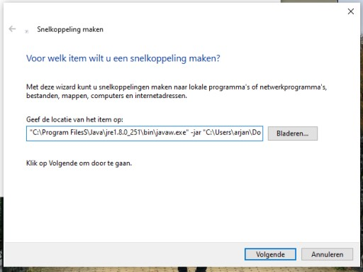

# Execute on Battery Status Change
A small Java application which executes another program every time a Windows laptop or tablet is plugged in or unplugged from the charger. Works with Windows 7 or newer.

# How to use
## Prerequisites
This application requires the Java Runtime Environment, version 1.8.0 or later, which can be downloaded from https://www.java.com/nl/download/

Install this before launching the application. This is a one-time process.

## Download the application
You can download the latest version [here](add-link)

## Creating the shortcut to launch it
Create a shortcut which has the following command:

```
"C:\Program Files\Java\jre1.8.0_<version>\javaw.exe" -jar "<<path_to_execute-on-battery-status-change.jar>>" "<program_to_run>" "<arguments_for_program_to_run"
```



Here's an example with Java 1.8.0_251 and with the program Auto Mouse Click:

```
"C:\Program Files\Java\jre1.8.0_251\bin\javaw.exe" -jar "C:\Users\Owner\Documents\execute-on-battery-status-change.jar" "C:\Program Files\Auto Mouse Click by MurGee.com\Schedule.exe" "C:\Users\Owner\Documents\click mouse.mamc"
```
Owner needs to be replaced with your user account name.

## Launch it manually
Click on the created shortcut. This will start the Java process.

If you plug in or disconnect your PC from the charger it should open the specified program. 

You can also verify that the Java program is running by opening Task Manager and clicking on More Details

## Automatically launch when starting up your computer
- Right-click the Windows start menu and click Run
- Type `shell:startup` and press Enter
- The Startup folder will open. Place the shortcut you've just created here
- Restart your PC to see the effect


# Developing this application
Due to the usage of WMIC to check the battery status, the application can only be developed on Windows-based computers.

However, the project can be loaded into any IDE which allows developing Java 8 applications, such as Eclipse, IntelliJ IDEA, VS Code or NetBeans. 

There are - except from needing to use Windows - no external dependencies and no package manager is needed. Only a Java 8 JDK is required (Oracle JDK or OpenJDK both work fine).
